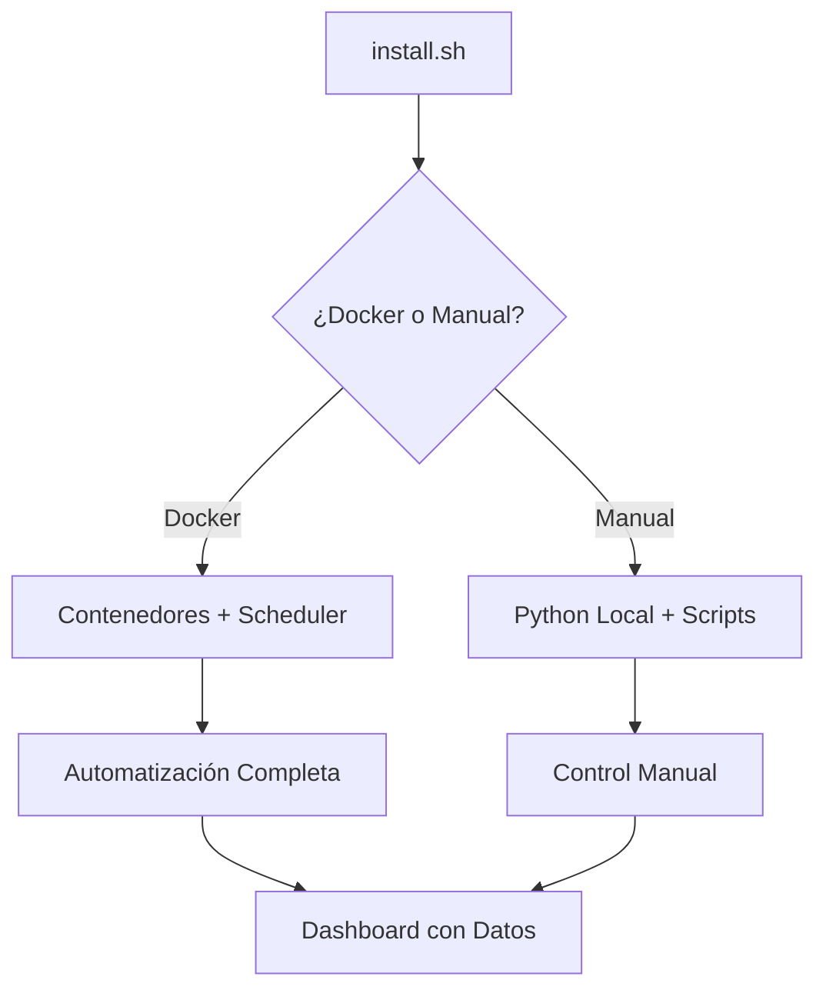

# 🐦 Paloma Licitera - Dashboard de Licitaciones

Sistema de monitoreo y análisis de licitaciones gubernamentales de México con **automatización ETL y Docker**.

## 🚀 Instalación Super Rápida

### ⚡ Un Solo Comando (Recomendado)
```bash
# Clonar e instalar automáticamente
git clone https://github.com/abueloide/paloma-licitera-new.git
cd paloma-licitera-new
chmod +x install.sh
./install.sh
```

**¡Eso es todo!** El script te guiará paso a paso y configurará todo automáticamente:
- 🐳 **Docker** (Opción 1): Instalación completamente automatizada 
- ⚡ **Manual** (Opción 2): Python + Node.js local

### 🎯 Resultado Inmediato
Después de `./install.sh` tendrás:
- ✅ **Dashboard**: http://localhost:8000
- ✅ **API REST**: http://localhost:8000/docs  
- ✅ **Scheduler**: Automatización ETL ejecutándose
- ✅ **PostgreSQL**: Base de datos lista
- ✅ **Datos reales**: De fuentes gubernamentales

---

## 🐳 Opción Docker (Recomendada)

Si eliges Docker en `./install.sh`, obtienes:

### Servicios Automáticos:
- **PostgreSQL**: Puerto 5432
- **API**: http://localhost:8000
- **Scheduler**: Actualizaciones automáticas

### Comandos Disponibles:
```bash
# Ver estado del sistema
./run-scheduler.sh status

# Actualización incremental
./run-scheduler.sh incremental

# Descarga histórica desde fecha
./run-scheduler.sh historico --fuente=all --desde=2025-01-01

# Ver logs en tiempo real
docker-compose logs -f scheduler

# Detener todo
./docker-stop.sh
```

## ⚡ Opción Manual

Si eliges instalación manual, usar:
```bash
./start_dashboard.sh  # Iniciar
./stop_dashboard.sh   # Detener
```

---

## 🤖 Sistema de Automatización ETL

### ✨ Scheduler Inteligente Incluido

El sistema incluye automatización completa:

#### 🕘 Horarios Automáticos:
- **🏢 ComprasMX**: Cada 6 horas (00:00, 06:00, 12:00, 18:00)
- **📅 DOF**: Solo martes y jueves (9:00-10:00 AM, 21:00-22:00 PM)
- **🏛️ Tianguis CDMX**: Cada 6 horas
- **📊 Sitios Masivos**: Domingos 2:00 AM

#### 🎛️ Controles Manuales:
```bash
# Estado del sistema
./run-scheduler.sh status

# Forzar actualización específica
./run-scheduler.sh incremental --fuente=comprasmx
./run-scheduler.sh incremental --fuente=dof
./run-scheduler.sh incremental --fuente=tianguis

# Descarga histórica masiva
./run-scheduler.sh historico --fuente=all --desde=2025-01-01
```

## 📊 Características Principales

### ✅ Funcionalidades Implementadas

- **Dashboard Principal**: Estadísticas generales y métricas clave
- **Lista de Licitaciones**: Búsqueda, filtrado y paginación
- **Detalle de Licitación**: Vista completa de cada licitación
- **Análisis Avanzado**: Gráficos y análisis por diferentes dimensiones
- **🆕 ETL Automático**: Extracción automatizada desde múltiples fuentes
- **🆕 Scheduler Inteligente**: Actualizaciones programadas y en tiempo real
- **🆕 Monitoreo Avanzado**: Estado del sistema y métricas detalladas
- **🆕 Dockerizado**: Fácil deployment y escalamiento
- **API REST**: Endpoints completos para todas las funcionalidades

### 🎯 Fuentes de Datos Soportadas

- **ComprasMX** (comprasgob.gob.mx) - Actualizaciones cada 6h
- **DOF** (Diario Oficial de la Federación) - Martes y jueves exactos
- **Tianguis Digital CDMX** - Actualizaciones cada 6h
- **Sistemas Estatales** - Procesamiento semanal

### 📱 Interfaz de Usuario

- **Responsive Design**: Optimizado para desktop y móvil
- **Búsqueda Avanzada**: Filtros por múltiples criterios
- **Visualizaciones**: Charts interactivos con datos en tiempo real
- **Paginación**: Manejo eficiente de grandes volúmenes de datos

## 🏗️ Arquitectura del Sistema

### Componentes Principales

```
paloma-licitera-new/
├── 🚀 install.sh                  # INSTALACIÓN AUTOMÁTICA
│
├── 🐳 Docker & Automation
│   ├── Dockerfile              # Contenedor principal
│   ├── docker-compose.yml      # Orquestación de servicios
│   ├── docker-start.sh         # Inicio rápido
│   └── run-scheduler.sh        # Comandos del scheduler
│
├── 🤖 Scheduler System
│   └── src/scheduler/
│       ├── scheduler_manager.py    # Manager principal
│       ├── scraper_wrappers.py    # Wrappers de extractores
│       ├── database_queries.py    # Queries especializadas
│       └── __main__.py           # CLI commands
│
├── 🌐 Frontend (React + TypeScript)
│   ├── src/
│   │   ├── components/       # Componentes reutilizables
│   │   ├── pages/           # Páginas principales
│   │   ├── services/        # API services
│   │   └── types/           # TypeScript types
│   └── package.json
│
├── 🔧 Backend (FastAPI)
│   ├── src/
│   │   ├── api.py              # FastAPI application
│   │   ├── database.py         # Database models & operations
│   │   ├── etl.py              # ETL processes
│   │   └── extractors/         # Data extractors
│
└── 📊 ETL Process
    └── etl-process/
        └── extractors/         # Scrapers por fuente
            ├── comprasMX/
            ├── dof/
            ├── tianguis-digital/
            └── sitios-masivos/
```

### 🔄 Flujo de Automatización



## 📋 API Endpoints

### Principales
- `GET /` - Información de la API
- `GET /stats` - Estadísticas generales
- `GET /licitaciones` - Lista de licitaciones con filtros
- `GET /detalle/{id}` - Detalle de licitación específica
- `GET /filtros` - Filtros disponibles

### Análisis
- `GET /analisis/por-tipo-contratacion` - Análisis por tipo de contratación
- `GET /analisis/por-dependencia` - Análisis por dependencia
- `GET /analisis/por-fuente` - Análisis por fuente
- `GET /analisis/temporal` - Análisis temporal

## 🔧 Configuración Avanzada

### Docker (Automático)
El `install.sh` configura todo automáticamente:
- Variables de entorno
- Volúmenes de datos
- Network interno
- Configuración del scheduler

### Manual (Personalizable)
```yaml
# config.yaml
database:
  host: localhost
  port: 5432
  name: paloma_licitera
  
automation:
  batch_config:
    diario: 
      hora: "06:00"
      fuentes: ["comprasmx", "dof", "tianguis"]
```

## 🛠️ Desarrollo y Debugging

### Docker Development
```bash
# Logs detallados
docker-compose logs -f scheduler
docker-compose logs -f paloma-app

# Acceso directo a contenedores
docker-compose exec scheduler bash
docker-compose exec postgres psql -U postgres -d paloma_licitera

# Reiniciar servicios específicos
docker-compose restart scheduler
```

### Manual Development
```bash
# Activar entorno
source venv/bin/activate

# Ejecutar backend
python src/api.py

# Ejecutar frontend (en otra terminal)
cd frontend && npm run dev

# Scheduler manual
python -m src.scheduler status
```

## 🚨 Solución de Problemas

### Problemas Comunes

**🐳 Docker no inicia:**
```bash
# Verificar Docker
docker --version
docker ps

# Reconstruir
docker-compose down
docker-compose build --no-cache
docker-compose up -d
```

**📊 Sin datos en dashboard:**
```bash
# Ejecutar carga inicial
./run-scheduler.sh incremental

# Ver estado
./run-scheduler.sh status

# Forzar descarga histórica
./run-scheduler.sh historico --fuente=all --desde=2025-01-01
```

**⏰ Scheduler no ejecuta:**
```bash
# Ver logs del scheduler
docker-compose logs scheduler

# Estado detallado
./run-scheduler.sh status | jq '.'

# Verificar horarios DOF
./run-scheduler.sh status | jq '.fuentes.dof'
```

## 📚 Tecnologías Utilizadas

### Backend & Automation
- **FastAPI** - Framework web moderno
- **PostgreSQL** - Base de datos robusta
- **Docker** - Containerización
- **Pandas** - Análisis de datos
- **BeautifulSoup4** - Web scraping
- **Playwright** - Browser automation
- **Schedule** - Task scheduling

### Frontend
- **React 18** - Librería de UI
- **TypeScript** - Tipado estático
- **Vite** - Build tool
- **Tailwind CSS** - Framework CSS

## 📖 Documentación Completa

- **[DOCKER_SCHEDULER_GUIDE.md](./DOCKER_SCHEDULER_GUIDE.md)** - Guía completa de Docker y Scheduler
- **[ChangesLog.md](./ChangesLog.md)** - Registro de cambios

## 🤝 Contribuir

1. Fork el repositorio
2. Instalar: `./install.sh`
3. Crear rama feature: `git checkout -b feature/AmazingFeature`
4. Commit cambios: `git commit -m 'Add some AmazingFeature'`
5. Push: `git push origin feature/AmazingFeature`
6. Abrir Pull Request

## 📞 Soporte y Troubleshooting

### Primeros Pasos
1. **Ejecutar**: `./install.sh` y seguir instrucciones
2. **Estado**: `./run-scheduler.sh status` (Docker)
3. **Logs**: `docker-compose logs -f scheduler`
4. **Documentación**: [DOCKER_SCHEDULER_GUIDE.md](./DOCKER_SCHEDULER_GUIDE.md)

### Issues Comunes
- **Puerto ocupado**: Cambiar puertos en `docker-compose.yml`
- **Permisos**: `chmod +x *.sh`
- **Docker no inicia**: Verificar Docker Desktop/daemon
- **Sin datos**: Ejecutar `./run-scheduler.sh incremental`

Para problemas específicos, crear un issue en GitHub con:
- Comando ejecutado
- Error completo
- Logs: `docker-compose logs`

---

**Estado del Proyecto:** ✅ **Producción con Instalador Automático**  
**Última Actualización:** Agosto 2025  
**Versión:** 2.1.0 (Install.sh + Docker + Scheduler)

**🚀 ¡Un solo comando y listo!** → `./install.sh`