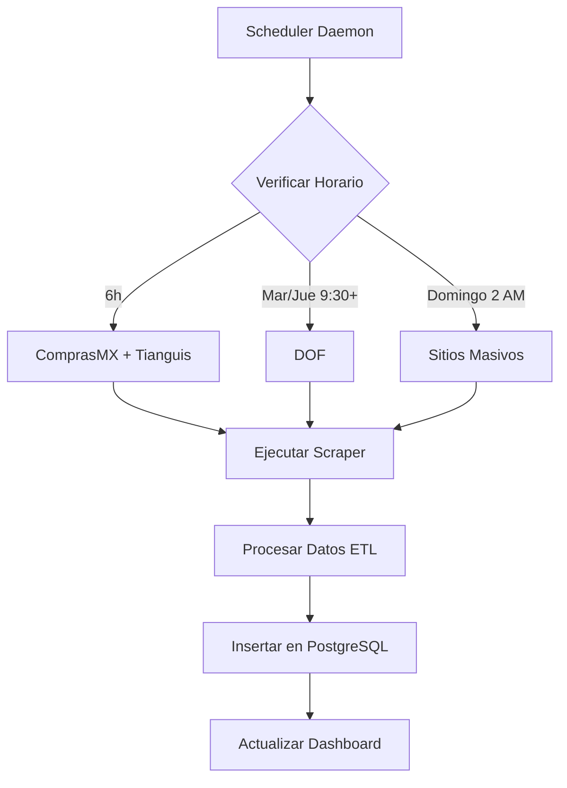

# 🐦 Paloma Licitera - Dashboard de Licitaciones

Sistema de monitoreo y análisis de licitaciones gubernamentales de México con **automatización ETL y Docker**.

## 🚀 Inicio Rápido

### Opción 1: Docker (Recomendado)
```bash
# Clonar repositorio
git clone https://github.com/abueloide/paloma-licitera-new.git
cd paloma-licitera-new

# Dar permisos y ejecutar
chmod +x docker-start.sh docker-stop.sh run-scheduler.sh
./docker-start.sh
```

**¡Listo!** Servicios disponibles:
- **Dashboard**: http://localhost:8000
- **API**: http://localhost:8000/docs
- **PostgreSQL**: localhost:5432
- **Scheduler**: Automático en segundo plano

### Opción 2: Instalación Manual

#### Prerrequisitos
- Python 3.8+
- Node.js 16+
- PostgreSQL 12+

#### Instalación y Ejecución

1. **Instalar dependencias del backend:**
```bash
pip install -r requirements.txt
```

2. **Instalar dependencias del frontend:**
```bash
cd frontend
npm install
```

3. **Inicializar la base de datos:**
```bash
python -c "from src.database import DatabaseManager; db = DatabaseManager(); db.create_tables()"
```

4. **Ejecutar el proyecto completo:**
```bash
# Linux/Mac
./start_project.sh

# Windows
start_project.bat
```

Esto iniciará:
- Backend FastAPI en http://localhost:8000
- Frontend React en http://localhost:3001

## 🤖 Sistema de Automatización ETL

### ✨ **¡NOVEDAD!** Scheduler Automático

El sistema incluye un **scheduler inteligente** que automatiza la extracción de datos:

#### Funcionalidades del Scheduler:
- **🔄 Actualizaciones Incrementales**: Cada 6 horas para ComprasMX y Tianguis
- **📅 DOF Inteligente**: Solo martes y jueves después de horarios de publicación
- **📊 Sitios Masivos**: Procesamiento semanal los domingos
- **🐳 Dockerizado**: Fácil despliegue y escalamiento
- **📈 Monitoreo**: Estado en tiempo real y métricas detalladas

### Comandos del Scheduler

```bash
# Estado del sistema
./run-scheduler.sh status

# Actualizaciones incrementales
./run-scheduler.sh incremental

# Descarga histórica desde fecha específica
./run-scheduler.sh historico --fuente=all --desde=2025-01-01

# Ejecuciones batch programadas
./run-scheduler.sh batch diario
./run-scheduler.sh batch cada_6h
./run-scheduler.sh batch semanal
```

### Docker Commands

```bash
# Iniciar servicios
./docker-start.sh

# Ver logs en tiempo real
docker-compose logs -f scheduler
docker-compose logs -f paloma-app

# Detener servicios
./docker-stop.sh

# Acceso directo a contenedores
docker-compose exec scheduler bash
docker-compose exec postgres psql -U postgres -d paloma_licitera
```

## 📊 Características Principales

### ✅ Funcionalidades Implementadas

- **Dashboard Principal**: Estadísticas generales y métricas clave
- **Lista de Licitaciones**: Búsqueda, filtrado y paginación
- **Detalle de Licitación**: Vista completa de cada licitación
- **Análisis Avanzado**: Gráficos y análisis por diferentes dimensiones
- **🆕 ETL Automático**: Extracción automatizada desde múltiples fuentes
- **🆕 Scheduler Inteligente**: Actualizaciones programadas y en tiempo real
- **🆕 Monitoreo Avanzado**: Estado del sistema y métricas detalladas
- **API REST**: Endpoints completos para todas las funcionalidades

### 🎯 Fuentes de Datos Soportadas

- **ComprasMX** (comprasgob.gob.mx) - Actualizaciones cada 6h
- **DOF** (Diario Oficial de la Federación) - Martes y jueves
- **Tianguis Digital CDMX** - Actualizaciones cada 6h
- **Sistemas Estatales** - Procesamiento semanal

### 📱 Interfaz de Usuario

- **Responsive Design**: Optimizado para desktop y móvil
- **Búsqueda Avanzada**: Filtros por múltiples criterios
- **Visualizaciones**: Charts interactivos con datos en tiempo real
- **Paginación**: Manejo eficiente de grandes volúmenes de datos

## 🏗️ Arquitectura del Sistema

### Componentes Principales

```
paloma-licitera-new/
├── 🐳 Docker & Automation
│   ├── Dockerfile              # Contenedor principal
│   ├── docker-compose.yml      # Orquestación de servicios
│   ├── init.sql               # Inicialización de BD
│   └── run-scheduler.sh       # Comandos del scheduler
│
├── 🤖 Scheduler System
│   └── src/scheduler/
│       ├── scheduler_manager.py    # Manager principal
│       ├── scraper_wrappers.py    # Wrappers de extractores
│       ├── database_queries.py    # Queries especializadas
│       └── __main__.py           # CLI commands
│
├── 🌐 Frontend (React + TypeScript)
│   ├── src/
│   │   ├── components/       # Componentes reutilizables
│   │   ├── pages/           # Páginas principales
│   │   ├── services/        # API services
│   │   └── types/           # TypeScript types
│   └── package.json
│
├── 🔧 Backend (FastAPI)
│   ├── src/
│   │   ├── api.py              # FastAPI application
│   │   ├── database.py         # Database models & operations
│   │   ├── etl.py              # ETL processes
│   │   └── extractors/         # Data extractors
│
└── 📊 ETL Process
    └── etl-process/
        └── extractors/         # Scrapers por fuente
            ├── comprasMX/
            ├── dof/
            ├── tianguis-digital/
            └── sitios-masivos/
```

### 🔄 Flujo de Automatización



## 📋 API Endpoints

### Principales
- `GET /` - Información de la API
- `GET /stats` - Estadísticas generales
- `GET /licitaciones` - Lista de licitaciones con filtros
- `GET /detalle/{id}` - Detalle de licitación específica
- `GET /filtros` - Filtros disponibles

### Análisis
- `GET /analisis/por-tipo-contratacion` - Análisis por tipo de contratación
- `GET /analisis/por-dependencia` - Análisis por dependencia
- `GET /analisis/por-fuente` - Análisis por fuente
- `GET /analisis/temporal` - Análisis temporal

## 🔧 Configuración Avanzada

### Variables de Entorno Docker
```yaml
# docker-compose.yml
environment:
  - DATABASE_HOST=postgres
  - DATABASE_PORT=5432
  - DATABASE_NAME=paloma_licitera
  - DATABASE_USER=postgres
  - DATABASE_PASSWORD=postgres123
```

### Configuración del Scheduler
```yaml
# config.yaml
automation:
  batch_config:
    diario: 
      hora: "06:00"
      fuentes: ["comprasmx", "dof", "tianguis"]
    cada_6h:
      horas: ["06:00", "12:00", "18:00", "00:00"]
      fuentes: ["comprasmx", "tianguis"]
    semanal:
      dia: "domingo"
      hora: "02:00"
      fuentes: ["sitios-masivos"]
```

## 🛠️ Desarrollo

### Backend (FastAPI)
```bash
# Ejecutar solo el backend
cd src
uvicorn api:app --reload --port 8000
```

### Frontend (React + Vite)
```bash
# Ejecutar solo el frontend
cd frontend
npm run dev
```

### Scheduler (Desarrollo)
```bash
# Ejecutar scheduler localmente
python -m src.scheduler --help
python -m src.scheduler status
python -m src.scheduler incremental
```

## 🚨 Solución de Problemas

### Docker Issues
```bash
# Ver logs detallados
docker-compose logs scheduler
docker-compose logs paloma-app

# Reiniciar servicios
./docker-stop.sh && ./docker-start.sh

# Reconstruir contenedores
docker-compose down && docker-compose build && docker-compose up -d
```

### Database Issues
```bash
# Verificar PostgreSQL
docker-compose exec postgres pg_isready -U postgres

# Ver estadísticas
docker-compose exec postgres psql -U postgres -d paloma_licitera -c "
SELECT fuente, COUNT(*) as total, MAX(fecha_captura) as ultima_actualizacion
FROM licitaciones GROUP BY fuente ORDER BY total DESC;"
```

### Scheduler Issues
```bash
# Estado detallado
./run-scheduler.sh status

# Logs del scheduler
docker-compose logs -f scheduler

# Ejecutar manualmente
./run-scheduler.sh incremental --fuente=comprasmx
```

## 📚 Tecnologías Utilizadas

### Backend & Automation
- **FastAPI** - Framework web moderno para Python
- **PostgreSQL** - Base de datos robusta y escalable
- **Docker** - Containerización y orquestación
- **Pandas** - Manipulación y análisis de datos
- **BeautifulSoup4** - Web scraping
- **Playwright** - Browser automation
- **Schedule** - Task scheduling

### Frontend
- **React 18** - Librería de UI
- **TypeScript** - Tipado estático
- **Vite** - Build tool y dev server
- **Tailwind CSS** - Framework de CSS
- **Lucide React** - Iconos
- **Date-fns** - Manipulación de fechas

## 📖 Documentación Completa

- **[DOCKER_SCHEDULER_GUIDE.md](./DOCKER_SCHEDULER_GUIDE.md)** - Guía completa de Docker y Scheduler
- **[ChangesLog.md](./ChangesLog.md)** - Registro de cambios y actualizaciones

## 🤝 Contribuir

1. Fork el repositorio
2. Crear una rama feature (`git checkout -b feature/AmazingFeature`)
3. Commit los cambios (`git commit -m 'Add some AmazingFeature'`)
4. Push a la rama (`git push origin feature/AmazingFeature`)
5. Abrir un Pull Request

## 📞 Soporte

Para problemas o preguntas:
1. Revisar [DOCKER_SCHEDULER_GUIDE.md](./DOCKER_SCHEDULER_GUIDE.md)
2. Ver logs: `docker-compose logs -f scheduler`
3. Verificar estado: `./run-scheduler.sh status`
4. Crear un issue en GitHub

---

**Estado del Proyecto:** ✅ **Producción con Automatización ETL**  
**Última Actualización:** Agosto 2025  
**Versión:** 2.0.0 (Docker + Scheduler)